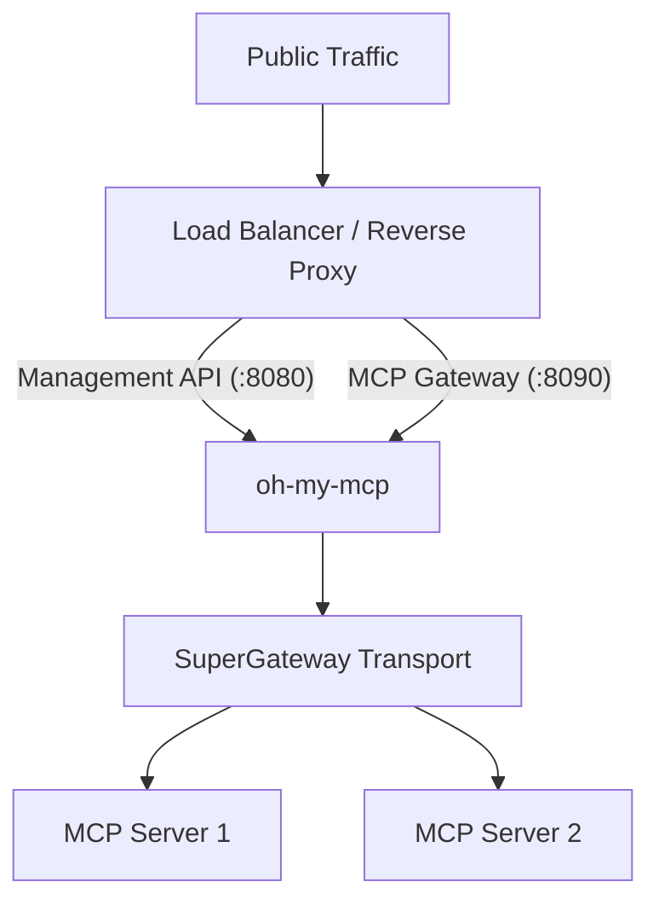

# Deployment Guide

Comprehensive guide for deploying **oh-my-mcp** in production environments.

## Overview

This guide covers production-ready deployment strategies, including native Linux services (Systemd), containerized environments (Docker), and orchestrated clusters (Kubernetes).

### Prerequisites

- Node.js 18+ (LTS recommended)
- SSL certificate (for any non-local deployment)
- Reverse proxy (Nginx, Traefik, or equivalent)

## Architecture

In production, oh-my-mcp typically sits behind a load balancer and reverse proxy that handles TLS termination and external rate limiting.



---

## 1. Native Service (Systemd)

Recommended for standalone Linux servers.

### Installation

```bash
sudo mkdir -p /opt/oh-my-mcp
sudo useradd -m -s /bin/bash mcp
sudo chown mcp:mcp /opt/oh-my-mcp

cd /opt/oh-my-mcp
npm install --production
npm run build
```

### Service Configuration

Create `/etc/systemd/system/oh-my-mcp.service`:

```ini
[Unit]
Description=oh-my-mcp - Native MCP Gateway
After=network.target

[Service]
Type=simple
User=mcp
Group=mcp
WorkingDirectory=/opt/oh-my-mcp
ExecStart=/usr/bin/node /opt/oh-my-mcp/dist/index.js /opt/oh-my-mcp/config.yaml
Restart=always
RestartSec=10
Environment=NODE_ENV=production
EnvironmentFile=/opt/oh-my-mcp/.env
NoNewPrivileges=true
ProtectSystem=strict
ProtectHome=true
PrivateTmp=true

[Install]
WantedBy=multi-user.target
```

### Management

```bash
sudo systemctl daemon-reload
sudo systemctl enable oh-my-mcp
sudo systemctl start oh-my-mcp
sudo journalctl -u oh-my-mcp -f  # View logs
```

---

## 2. Docker & Docker Compose

Recommended for containerized environments.

### Dockerfile

```dockerfile
FROM node:20-alpine AS builder
WORKDIR /app
COPY package*.json ./
RUN npm ci --only=production
COPY . .
RUN npm run build

FROM node:20-alpine
WORKDIR /app
COPY --from=builder /app/package*.json ./
COPY --from=builder /app/dist ./dist
COPY --from=builder /app/node_modules ./node_modules
COPY config.yaml /app/config.yaml

EXPOSE 8080 8090
ENV NODE_ENV=production
CMD ["node", "dist/index.js", "/app/config.yaml"]
```

### Docker Compose

```yaml
services:
  oh-my-mcp:
    image: oh-my-mcp:latest
    ports:
      - "8080:8080" # Management
      - "8090:8090" # Gateway
    volumes:
      - ./config.yaml:/app/config.yaml:ro
    environment:
      - NODE_ENV=production
    restart: unless-stopped
    healthcheck:
      test: ["CMD", "node", "-e", "require('http').get('http://localhost:8080/health', (r)=>{if(r.statusCode!==200)process.exit(1)})"]
```

---

## 3. Kubernetes

Recommended for highly available clusters.

### ConfigMap

```yaml
apiVersion: v1
kind: ConfigMap
metadata:
  name: oh-my-mcp-config
data:
  config.yaml: |
    managementPort: 8080
    gatewayPort: 8090
    logLevel: info
    servers:
      example:
        command: ["npx", "-y", "@modelcontextprotocol/server-example"]
        enabled: true
```

### Deployment

```yaml
apiVersion: apps/v1
kind: Deployment
metadata:
  name: oh-my-mcp
spec:
  replicas: 2
  selector:
    matchLabels:
      app: oh-my-mcp
  template:
    metadata:
      labels:
        app: oh-my-mcp
    spec:
      containers:
        - name: oh-my-mcp
          image: oh-my-mcp:latest
          ports:
            - containerPort: 8080
              name: management
            - containerPort: 8090
              name: gateway
          volumeMounts:
            - name: config
              mountPath: /app/config.yaml
              subPath: config.yaml
          resources:
            requests: { memory: "128Mi", cpu: "100m" }
            limits: { memory: "256Mi", cpu: "200m" }
          livenessProbe:
            httpGet: { path: /health, port: 8080 }
      volumes:
        - name: config
          configMap: { name: oh-my-mcp-config }
```

---

## Operations & Security

### Security Checklist

- [ ] Run as non-root user (Systemd `User=mcp` or Docker `USER node`).
- [ ] Enable TLS/SSL at the reverse proxy level.
- [ ] Use environment variables (`.env` or K8s Secrets) for sensitive tokens.
- [ ] Set up firewall (UFW) to only allow ingress to 443/80.

### Monitoring

- **Health Checks**: `GET /health` (Management API).
- **Metrics**: `GET /metrics` (Prometheus format).
- **Logs**: Structured JSON logs are emitted to stdout.

### Updates

1. Pull new code/image.
2. Rebuild if running natively.
3. Restart service: `sudo systemctl restart oh-my-mcp` or `kubectl rollout restart deployment/oh-my-mcp`.
